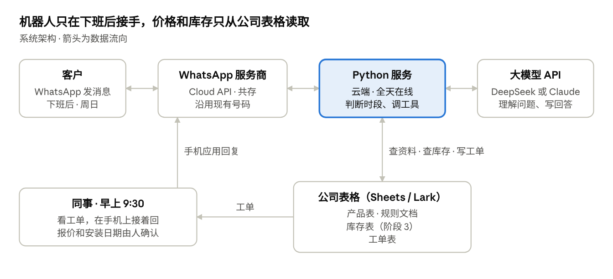
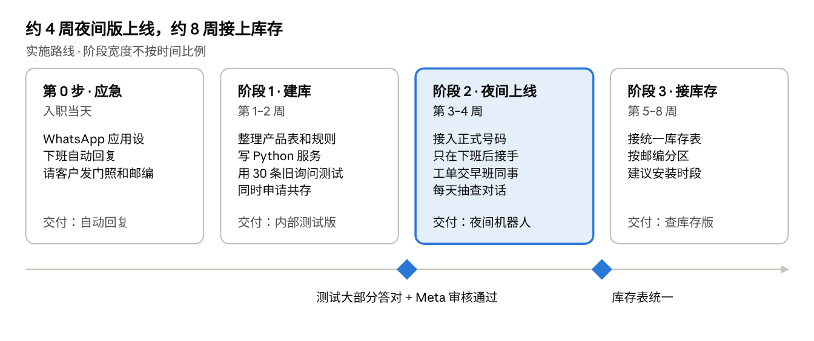
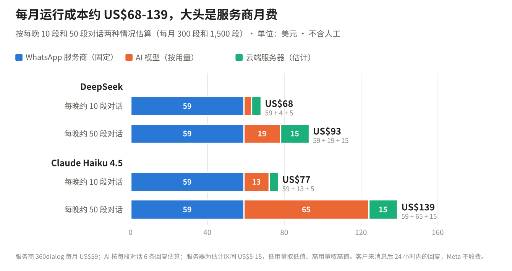

# SINGXXXX 夜间客服机器人：技术路线与实施计划

v0.6 · 2026-10-06 · Toni

## 一页结论

现有的 WhatsApp 号码接上云端 AI，晚上自动回客户、收集安装信息，第二天交给同事。夜间版大约 4 周上线，接库存大约 8 周。每月运行成本估计 US$68-93（用 DeepSeek）或 US$77-139（用 Claude），人工不算在内。

| 项目 | 做法 |
| --- | --- |
| 渠道 | 沿用现有的 WhatsApp Business 号码，通过服务商开通 Cloud API，和手机应用同时用 |
| AI 模型 | 调云端大模型的 API，程序里可以换：测试先用 DeepSeek-Flash，正式上线前在 DeepSeek 和 Claude Haiku 4.5 之间选 |
| 资料库 | 一张产品表，加一份 FAQ 和安装规则，放在 Google Sheets 或 Lark |
| 程序 | 一个小的 Python 服务，跑在云端，负责收消息、调 AI、查表、开工单 |
| 交接 | 机器人在工单表里写一行，同事早上 9:30 在手机 WhatsApp 里接着回 |
| 周期 | 第 0 步当天就能做；夜间问答版约 4 周；库存和排期约 8 周 |
| 每月成本 | 服务商约 US$59，AI 约 US$4-19（DeepSeek）或 US$13-65（Claude），服务器估计 US$5-15 |

机器人负责给参考答案、收集信息。折扣和安装日期它不碰，一律由人来定。客户的电话、地址、门的照片也不会发给模型，只存在公司账号下的表格里。

## 整体架构

客户发来的消息经服务商转到 Python 服务。服务把对话和公司资料一起交给大模型，需要时去查表、写工单。第二天，同事用同一个号码在手机应用里接着聊。

## 接哪些 API 和服务

外部服务一共三样，都是按月或按用量付费，公司不用买硬件。

| 服务 | 用途 | 选择 | 原因 |
| --- | --- | --- | --- |
| [WhatsApp Business Platform（Cloud API）](https://developers.facebook.com/docs/whatsapp/pricing) | 收客户消息、发回复 | 通过官方服务商（BSP）接入，比如 [360dialog](https://docs.360dialog.com/docs/get-started/pricing) | 自动回复只能走 API，手机上的 WhatsApp Business 应用接不了 AI |
| 共存（Coexistence） | 同一个号码，手机应用和 API 一起用 | 服务商开通，扫码绑定现有号码 | 同事照旧用手机回客户，机器人只在晚上接手，号码也不用换 |
| 大模型 API | 读懂问题、组织回答、判断什么时候查库存 | DeepSeek-Flash 或 [Claude Haiku 4.5](https://platform.claude.com/docs/en/about-claude/pricing)，可以切换（对比见下表） | 便宜、快，中英文都行；按用量收费，没有最低消费 |
| Google Sheets 或 Lark 多维表 | 放产品表、库存表、工单表 | 公司现在用哪个就用哪个 | 同事本来就会用，改价格、改库存不用找程序员 |

### 模型选哪家

程序写成可以换模型。先用 DeepSeek 测试，正式上线前由管理层按成本和数据要求来定。

| | DeepSeek-Flash | Claude Haiku 4.5 |
| --- | --- | --- |
| 价格（每百万 token，输入 / 输出） | US$0.3 / US$1.2（高峰价，非高峰减半） | US$1 / US$5 |
| 本方案每月 AI 费用 | 约 US$4-19 | 约 US$13-65 |
| 工具调用（查库存、写工单） | 支持 | 支持 |
| 数据存放 | 隐私政策写明个人数据在中国处理和存储；API 数据的条款没有写明 | 上线前核对商业数据条款 |
| 回答质量 | 拿同一批 30 条旧询问实测后再定 | 同左 |

来源：[DeepSeek 定价](https://api-docs.deepseek.com/quick_start/pricing)、[DeepSeek 隐私政策](https://cdn.deepseek.com/policies/en-US/deepseek-privacy-policy.html)、[Claude 定价](https://platform.claude.com/docs/en/about-claude/pricing)。

### 为什么不在本地部署模型

本地部署得买带显卡的服务器，还得有人维护。普通服务器上跑得动的开源小模型，回答质量明显不如云端的大模型。十来个人的公司，这笔钱和人力不划算。

### 数据怎么管

客户的电话、地址、邮编、门的照片只存在公司账号下的表格里，不发给模型。发给 AI 的只有问题本身和产品资料。客户如果在消息里自己写了电话或地址，程序先遮掉再发。官网的会员资料留在 Shopify 后台，不接进机器人。是否完全符合 PDPA 对跨境传输的要求，上线前还要再确认。

### 和公司现有数据怎么接

机器人只读公司的数据，不改任何主数据。它唯一会写的是自己的工单表。

晚上没人出入库，所以夜间版不用一直连着公司系统：每天下班后同步一次库存快照，晚上就用这份快照回答。以后白天也要查，再改成实时调用。权限只开只读，密钥存在云端服务里，公司随时可以收回，每次查询都有记录。

具体怎么接，看库存现在记在哪里：

| 库存记在 | 接法 | 对周期的影响 |
| --- | --- | --- |
| Shopify 后台 | 开一个只读的 API 权限（产品和库存），每晚自动同步到机器人用的表 | 基本不变 |
| 同事电脑里的 Excel | 先搬到共享位置（Google Sheets 或 OneDrive），定好格式和由谁更新，机器人读共享的那份 | 估计多 1 周左右 |
| Lark 多维表格 | 用 Lark 开放接口读取，权限只开这一张表 | 基本不变 |
| 会计或 ERP 软件 | 先看有没有 API；没有的话，每天导出一份报表给机器人读 | 要看是什么软件，评估后再定 |
| 主要靠人记 | 先建一张库存表，由运营每天更新。表建好之前，机器人只答 FAQ | 第 0 步改成建表 |

还有两件事要先对齐。一是官网、仓库和供应商的型号名称是不是同一套，不是的话先做一张对照表。二是已经约好、还没装的锁，要不要先从库存里扣掉。对客户，建议只说「有货」或「需要调货」，不报具体件数，免得被当成承诺。

### 共存要注意的地方

据服务商说明，共存模式没有纯 API 稳定，旧聊天记录里的图片可能同步不全。号码如果以前接过别的服务商，要先解绑。开通前得请服务商确认这个号码符合 Meta 的条件（[说明](https://kapso.com/blog/whatsapp-business-app-coexistence-cloud-api)）。

## 资料库怎么建

资料库就是三张表加一份文档，不需要训练模型。官网几十个商品加上 FAQ，量不大，可以整份放进 AI 的提示词里，用提示词缓存把成本压下来。以后资料多到几百页，再改成按问题检索。

| 资料 | 内容 | 格式 | 谁维护 |
| --- | --- | --- | --- |
| 产品表 | 型号、门锁还是闸锁、开锁方式、材质、电池、适用门型、现价、套装组合 | Google Sheets / Lark，一行一个型号 | 运营（我），促销前后改价格 |
| 库存表 | 型号、可用数量、到货日期 | 同上 | 仓库或运营，每天或每次进出货时更新 |
| 工单表 | 机器人写入：时间、客户号、房型、门型、邮编、意向型号、照片、下一步 | 同上 | 机器人写，同事早上处理并标状态 |
| FAQ 和规则文档 | 安装时长、门闸间距、空跑费、保修、没电怎么开、展厅时间；再加一份「不能回答的问题」清单 | 一份文档 | 运营整理，管理层确认 |

建库步骤：

1. 从官网导出全部商品（Shopify 自带产品数据），整理成产品表，删掉重复的和过期的促销。
2. 把官网 FAQ、安装页、保修条款合成一份规则文档。
3. 请销售同事列出最常被问的 20 个问题和标准答法，补进文档。
4. 和管理层定好哪些话机器人不能说：折扣、具体安装日期、非标准门（玻璃门、金属门、商业场所）的报价。
5. 拿 30 条真实的历史询问（去掉个人信息）来测，哪里答错就补哪里的资料，直到大部分问题能答对，或者能正确转给人。

## 部署方式

程序是一个小的 Python 网络服务，跑在云端，全天在线，公司电脑关机也不影响。

它做五件事：

1. 收消息：WhatsApp 有新消息时，服务商把消息推给这个服务（webhook）。
2. 看时段：办公时间不插手，留给同事回；下班后和周日由机器人接手。
3. 问 AI：把对话、产品表、规则文档发给大模型，由它组织回答。
4. 调工具：AI 需要时，程序去查库存表、写工单表，再把结果交回给 AI。
5. 回复并记录：通过 API 把回复发给客户，同时把对话存下来，方便每周抽查。

要开的账号（都用公司名义开，归公司所有）：

- [ ] Meta Business 账号和商家验证
- [ ] WhatsApp 服务商账号（开通共存）
- [ ] 大模型 API 账号（设每月用量上限）
- [ ] 云服务器账号（比如 Google Cloud 或类似平台）
- [ ] Google 或 Lark 工作区，用来放三张表

代码和配置放在公司账号下的代码仓库，附一页操作说明。以后谁接手都找得到。

## 周期

阶段 2 能不能按时上线，要看 Meta 审核共存的进度，所以阶段 1 就要提交申请。审核卡住的话，先用测试号码或官网聊天窗口上线。以上周数按我全职投入来算。

## 维护

平时维护主要是改表格，不是改代码。估计每周 1-2 小时，由我负责。

| 频率 | 做什么 | 时长（估计） |
| --- | --- | --- |
| 每天早上 | 看夜间工单，分给销售或售后；答错的对话记下来 | 10-15 分钟 |
| 促销前后 | 改产品表的价格和套装，改规则文档里的促销说明 | 15-30 分钟 |
| 每周 | 抽查 20 段左右的对话，答错的、转人工太多的问题补进资料 | 约 1 小时 |
| 每月 | 对一遍 AI 和服务商的账单；看夜间询问量、转人工的比例、成交单数 | 约 30 分钟 |

出了问题怎么办：

- AI 答错了：改资料，不改模型。以后同类问题都会按新资料回答。
- 服务停了（服务器或接口出故障）：手机上的 WhatsApp 照样收得到消息，同事早上照常回。另外留一条下班自动回复兜底。
- 费用不对劲：大模型账号设了每月用量上限，超了会自动停，不会冒出意外的大账单。
- 我不在：代码、账号、操作说明都在公司名下，同事照着说明能改表格；改代码要找懂 Python 的人。

## 成本估算

每月运行成本估计 US$68-93（DeepSeek）或 US$77-139（Claude），大头是服务商月费。一次性成本只有我的开发时间，不用买硬件或软件许可。

| 项目 | 每月（US$） | 依据 |
| --- | --- | --- |
| WhatsApp 服务商月费 | 59 | [360dialog](https://docs.360dialog.com/docs/get-started/pricing) 普通档每个号码每月 US$59；其他服务商另外比价 |
| WhatsApp 消息费 | 约 0 | Meta 从 2025 年 7 月起按条计费，客户先发消息后 24 小时内的回复免费（[Meta 定价](https://developers.facebook.com/docs/whatsapp/pricing)）。只有主动群发营销消息才收费 |
| AI 模型 | 4-19（DeepSeek）/ 13-65（Claude） | 按下面的算法，每晚 10-50 段对话 |
| 云服务器 | 5-15 | 估计值，没有核实，以所选平台的报价为准 |
| 合计 | 68-93 / 77-139 | |

AI 费用的算法，以 Claude Haiku 4.5 为例（输入每百万 token US$1，输出每百万 token US$5，[官方价格](https://platform.claude.com/docs/en/about-claude/pricing)）：

- 假设每段对话机器人回 6 次。每次发给 AI 约 6,000 token（规则、产品表、对话记录），AI 回约 250 token。
- 每次回复 = 6,000 × 1 ÷ 1,000,000 + 250 × 5 ÷ 1,000,000 = US$0.00725；每段对话 = 0.00725 × 6 = US$0.0435。
- 每晚 10 段 × 30 天 = 300 段，约 US$13；每晚 50 段 × 30 天 = 1,500 段，约 US$65。
- 开了提示词缓存后，重复发送的规则和产品表按 0.1 倍计价，实际会更低。上面没算缓存折扣，是保守估计。

换成 DeepSeek-Flash，假设不变（高峰价：输入每百万 token US$0.3，输出 US$1.2，[官方价格](https://api-docs.deepseek.com/quick_start/pricing)）：

- 每次回复 = 6,000 × 0.3 ÷ 1,000,000 + 250 × 1.2 ÷ 1,000,000 = US$0.0021；每段对话 = 0.0021 × 6 = US$0.0126。
- 300 段约 US$4，1,500 段约 US$19。新加坡的晚上大多落在它的非高峰时段，价格还能再减半；这里按高峰价算，偏保守。

还缺一个数字：每晚大概有多少条询问。AI 费用的估算主要就看它。

## 以后能扩展什么

系统分三层：消息渠道、AI 模型、公司数据。以后加功能，多半是多接一份数据、给机器人多一个工具，前两层不用重做。能不能做，主要看对应的数据有没有人在记。

| 方向 | 做什么 | 需要的数据 |
| --- | --- | --- |
| 经营数据分析 | 每周汇总：几点询问最多，最常被问的问题和型号，机器人答不了的问题，问了但缺货的次数，询问来自哪些区域 | 现有的工单表，攒几个月就够 |
| 补货提醒 | 库存低于设定数量、又有客户在问时，提醒负责采购的同事 | 库存表和工单表 |
| 安装路线 | 先按区域把同一天的安装排在一起；接上师傅排班和地图服务（比如 [OneMap](https://www.developer.tech.gov.sg/products/categories/data-and-apis/onemap-apis/overview)）后，每天给出建议路线，运营确认后再发给师傅 | 邮编（已在收集）、师傅排班 |
| 售后提醒 | 电池、保修到期、装完后的回访 | 购买和安装记录。公司主动发的 WhatsApp 消息按条收费 |
| 内部助手 | 同事在 Lark 或 WhatsApp 里直接问库存和排班 | 同一份库存表和排班 |
| 招聘初筛 | 收集应聘者的可工作时间、经验和证件类型，整理成表 | 招聘要求。录用由人决定 |
| 官网聊天窗口 | 同一个后台接到官网，回答和 WhatsApp 上一致 | 不需要新数据 |

自动化分档推进，每升一档都先跑一段时间，看准确率再往下走：

| 档位 | 机器人做什么 | 例子 |
| --- | --- | --- |
| 第 1 档 | 回答、收集信息 | 夜间版 |
| 第 2 档 | 给建议，人来确认 | 建议时段、建议路线、报价草稿 |
| 第 3 档 | 在定好的规则内自动执行 | 发提醒、确认改约、补货预警 |
| 一直由人做 | 不自动化 | 折扣、价格承诺、退款、投诉、录用 |

这些是方向，不是承诺。拿到单量数据之前，不估算能省多少时间或成本。4 个师傅的规模，路线先做到按区域分组就够用，优化算法等单量上来再考虑。

## 风险和待确认的问题

最没把握的是 WhatsApp 共存能不能顺利开通，其次是库存现在记在哪里。周期要不要调，就看这两点。

| 风险 | 影响 | 对策 |
| --- | --- | --- |
| 开通共存被 Meta 卡住 | WhatsApp 版要推迟 | 先用官网聊天窗口或测试号码上线，同时跟进 Meta 审核 |
| AI 把价格或适配答错 | 客户投诉、丢单 | 价格只从产品表读；拿不准就转人工；上线头两周每天抽查 |
| 库存数据分散或不准 | 机器人说有货，实际没有 | 第 3 阶段前先把库存表统一；在那之前机器人只说「请同事确认库存」 |
| 客户个人资料 | PDPA 合规 | 资料只存在公司账号的表格里，设访问权限，定期清理 |
| 同事担心客户被机器人「抢走」 | 不愿配合 | 机器人只管下班时段，白天照旧；工单直接交回原来的销售跟进 |

待确认（前 3 个最影响周期）：

1. 现在库存记在哪里？Shopify 后台的数字和仓库实际对得上吗？
2. 库存由谁更新，多久更新一次？
3. 官网、仓库和供应商的型号名称是同一套吗？套装怎么记库存？
4. 已经约好、还没装的锁，会先从库存里扣掉吗？
5. 缺货的型号一般多久能补到货？
6. 会员资料和购买记录在 Shopify 里吗？老客户来问售后，现在怎么查保修期？
7. 师傅的排班记在哪里？
8. 开只读的 API 权限由谁批？公司有 IT 负责人或外包的建站公司吗？
9. 每晚大概有多少条询问？新客户咨询多，还是售后多？
10. 公司 WhatsApp 号码现在由谁在回？接了机器人以后，早上谁来接工单？
11. 公司平时用 Google 还是 Lark？
12. 哪些问题绝对不能让机器人答？
13. 这个项目的预算上限是多少，希望什么时候上线？

## 参考资料

- [Pricing on the WhatsApp Business Platform（Meta）](https://developers.facebook.com/docs/whatsapp/pricing)
- [360dialog 价格与套餐](https://docs.360dialog.com/docs/get-started/pricing)
- [Claude API 定价（Anthropic）](https://platform.claude.com/docs/en/about-claude/pricing)
- [DeepSeek 定价](https://api-docs.deepseek.com/quick_start/pricing)
- [DeepSeek 隐私政策](https://cdn.deepseek.com/policies/en-US/deepseek-privacy-policy.html)
- [PDPC 指南：跨境转移限制（第 19 章）](https://www.pdpc.gov.sg/-/media/Files/PDPC/PDF-Files/Advisory-Guidelines/the-transfer-limitation-obligation---ch-19-(270717).pdf)
- [OneMap API（新加坡政府）](https://www.developer.tech.gov.sg/products/categories/data-and-apis/onemap-apis/overview)
- [WhatsApp Business App coexistence with Cloud API（Kapso）](https://kapso.com/blog/whatsapp-business-app-coexistence-cloud-api)
